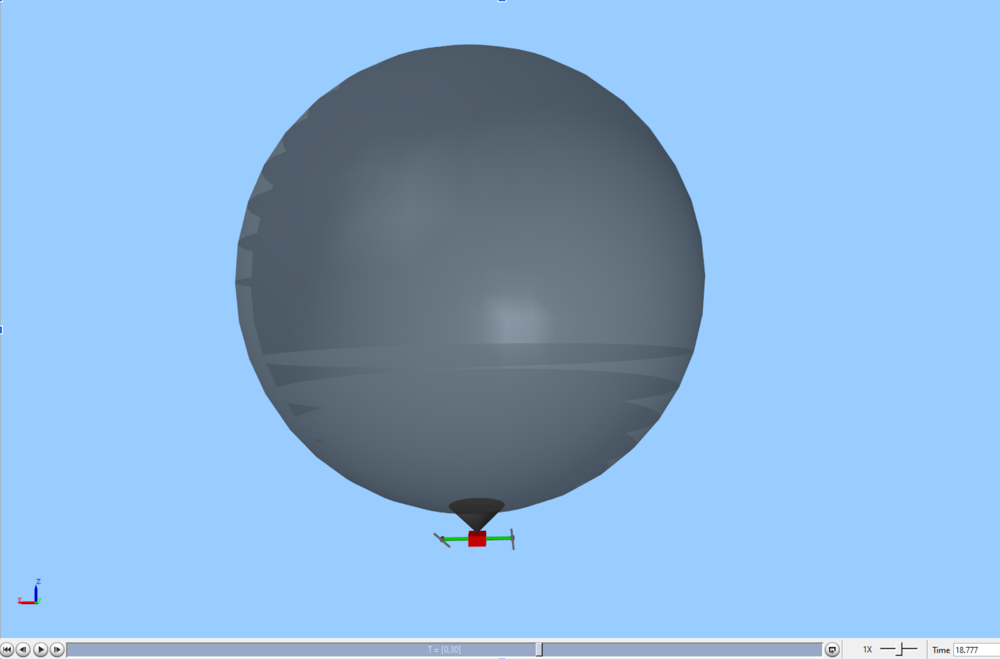

# HAB Simulation Model

## Description
This MATLAB-based simulation models the behavior of a high-altitude balloon system, including environmental dynamics, mechanical response, and control logic. It is designed to test and validate control strategies, such as reinforcement learning agents, in a realistic and configurable environment.



A copy of the latest model training, with over 1,200 iterations, is available in the `habModel` directory. This includes both the exported model and the converted output header file `hab_model.h`, suitable for deployment on the flight computer.

## Usage
1. **Load Simulation Constants**

Before starting, load all necessary simulation constants:
```matlab
run('constants.m')
```

2. **Train the RL Agent**

Launch the training process using:
```matlab
run('train.m')
```

3. **Export the Trained Model**

Once training is complete, export the model for deployment:
```matlab
run('export_model.m')
```

This will export the model into the `habModel` directory.

4. **Convert the Model to TensorFlow Lite**

Convert the exported model to a TensorFlow Lite format using the provided Python script. [TensorFlow](https://www.tensorflow.org/install) must be installed prior to running this script.
```bash
python convert_model.py
```

A `hab_model.h` file will be generated in the project's root folder. This can be directly imported to the flight computer.
